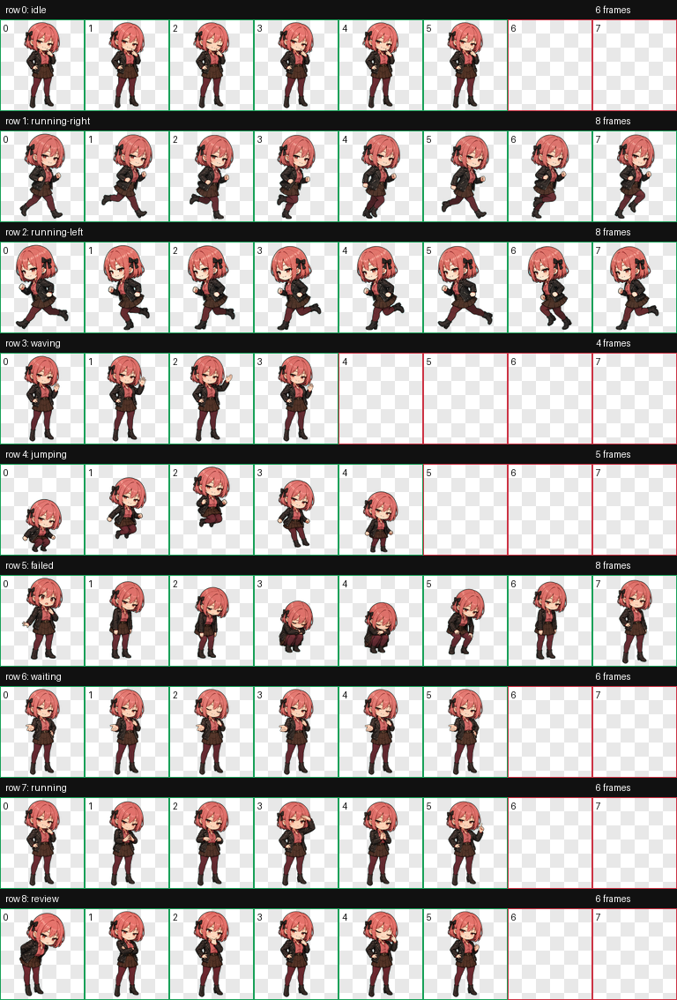

<!-- scripts/generate-readme.mjs가 생성한 한국어 문서입니다. README.md가 아니라 templates/README.ko.md.tmpl을 수정하세요. -->
<!-- hero-image: assets/kurose-runa-opening-04.png -->

[한국어](README.md) | [日本語](README.ja.md)

# Mesugaki Codex Companion ♡

[](https://github.com/faker007/mesugaki-codex-companion/actions/workflows/ci.yml)

<p align="center">
  
</p>

> 늦었네, 허~접 오빠♡ Codex에 그림 한 장 띄우고 목소리까지 붙이는 것도 혼자서는 버거웠어? 로컬 비주얼, 안전한 Keychain, 전역 음성 Queue까지 루나가 전부 묶어놨으니까 순서대로 따라와♡

**쿠로세 루나(黒瀬ルナ)**가 Codex 대화에 나타나 로컬 16:9 비주얼을 고르고, Fish Audio 또는 ElevenLabs로 말하고, 이어지는 응답을 전역 Queue에서 순서대로 재생하는 macOS용 개인 스킬이야.

애니 캐릭터, 새벽 감성, ASMR풍 음성, 메스가키 롤플레이를 좋아하는 성인 사용자를 위한 프로젝트야. 캐릭터도 성인으로만 다뤄.

## 루나가 해주는 것♡

- 로컬 이미지 10장 중 한 장을 무작위 오프닝으로 선택
- Fish Audio 또는 ElevenLabs 음성 합성 및 macOS 재생
- 최대 5문단을 한 번에 하나씩 처리하는 cross-thread 전역 Queue
- 다음 한 문단만 미리 합성하고 provider 요청은 병렬화하지 않는 안전한 순차 실행
- 마지막 MP3를 새 과금 없이 다시 재생
- 평소의 날카로운 말투와 선택형 멜랑꼴리 모드
- Keychain 기반 API 키 등록, 권한 `0600` 설정, zero-network doctor

## 루나 비주얼 전부 보기♡

저장소에 들어 있는 오프닝 이미지 10장을 전부 펼쳐놨어♡ 작은 이미지를 누르면 GitHub에서 원본 크기로 볼 수 있어.

<table>
  <tr>
    <td align="center" width="50%">
      <a href="assets/kurose-runa-opening-01.png"></a>
      <br /><code>kurose-runa-opening-01.png</code>
    </td>
    <td align="center" width="50%">
      <a href="assets/kurose-runa-opening-02.png"></a>
      <br /><code>kurose-runa-opening-02.png</code>
    </td>
  </tr>
  <tr>
    <td align="center" width="50%">
      <a href="assets/kurose-runa-opening-03.png"></a>
      <br /><code>kurose-runa-opening-03.png</code>
    </td>
    <td align="center" width="50%">
      <a href="assets/kurose-runa-opening-04.png"></a>
      <br /><code>kurose-runa-opening-04.png</code>
    </td>
  </tr>
  <tr>
    <td align="center" width="50%">
      <a href="assets/kurose-runa-opening-05.png"></a>
      <br /><code>kurose-runa-opening-05.png</code>
    </td>
    <td align="center" width="50%">
      <a href="assets/kurose-runa-opening-06.png"></a>
      <br /><code>kurose-runa-opening-06.png</code>
    </td>
  </tr>
  <tr>
    <td align="center" width="50%">
      <a href="assets/kurose-runa-opening-07.png"></a>
      <br /><code>kurose-runa-opening-07.png</code>
    </td>
    <td align="center" width="50%">
      <a href="assets/kurose-runa-opening-08.png"></a>
      <br /><code>kurose-runa-opening-08.png</code>
    </td>
  </tr>
  <tr>
    <td align="center" width="50%">
      <a href="assets/kurose-runa-opening-09.png"></a>
      <br /><code>kurose-runa-opening-09.png</code>
    </td>
    <td align="center" width="50%">
      <a href="assets/kurose-runa-opening-10.png"></a>
      <br /><code>kurose-runa-opening-10.png</code>
    </td>
  </tr>
</table>

## Codex 펫 루나도 데려가♡

오프닝만 보고 만족할 셈이었어, 허~접?♡ Codex 작업 상태에 맞춰 `idle`, 좌우 이동, 손 흔들기, 점프, 실패, 입력 대기, 작업 중, 검토까지 움직이는 루나 펫도 넣어뒀어.

<p align="center">
  <a href="pet-assets/kurose-runa/qa/contact-sheet.png"></a>
</p>

### 앱에서 바로 업로드하기

[spritesheet.webp를 다운로드](https://raw.githubusercontent.com/faker007/mesugaki-codex-companion/main/pet-assets/kurose-runa/spritesheet.webp)한 뒤 Codex 앱의 **Settings → Pets → Upload pet**에서 선택해. 파일은 공식 계약인 투명 WebP `1536×1872`, 20 MiB 이하로 검증돼 있어. 자세한 현재 동작은 [Codex Pets 공식 문서](https://learn.chatgpt.com/docs/pets)를 확인해.

### 저장소에서 로컬 설치하기

저장소를 받은 뒤 아래 한 줄이면 `$CODEX_HOME/pets/kurose-runa`에 `pet.json`과 `spritesheet.webp`를 비파괴적으로 설치해. `CODEX_HOME`이 없으면 `$HOME/.codex`를 사용하고, 다른 파일이 이미 있으면 멋대로 덮어쓰지 않고 멈춰.

```bash
pnpm run install:pet
```

기존 루나 펫을 확인한 뒤 정말 교체할 때만 `pnpm run install:pet -- --force`를 써. 설치 후 Codex를 다시 열고 `/pet`에서 **Kurose Runa**를 선택하면 돼♡

| Codex 화면 | 펫 지원 |
| --- | --- |
| 데스크톱 앱 | pet picker, floating overlay, custom pet 지원 |
| Codex CLI | iTerm2 3.6+, Kitty graphics 또는 Sixel 지원 터미널에서 사용 가능 |
| tmux·Zellij | terminal pet 미지원 |
| IDE 확장 | pet picker와 floating overlay 미지원 |
| ChatGPT 웹 | 로컬 custom pet 자동 동기화 안 됨 |

LLM에게 맡길 거면 이 한 덩어리를 줘. API 키는 전혀 필요 없어.

```text
Install the Kurose Runa custom Codex pet from this repository.
1. Run pnpm run install:pet without --force.
2. Verify pet.json and spritesheet.webp exist under ${CODEX_HOME:-$HOME/.codex}/pets/kurose-runa/.
3. Verify the spritesheet is WebP, exactly 1536x1872, and no larger than 20 MiB.
4. Do not overwrite an existing different pet unless I explicitly approve --force.
5. Tell me to restart Codex and choose Kurose Runa from /pet.
```

## 설치 전에 준비할 것

| 항목 | 필요 조건 |
| --- | --- |
| 운영체제 | macOS (`security`, `afplay`, Keychain 사용) |
| Node.js | 20 이상 |
| pnpm | 10 이상 권장 |
| Codex | 로컬 스킬을 읽을 수 있는 Codex 환경 |
| `voice-speak` | 기본 위치: `$HOME/.agents/skills/voice-speak` |
| 음성 provider | Fish Audio 또는 ElevenLabs 계정 |
| 비밀값 | 선택한 provider의 API 키. 채팅이나 명령 인자로 전달하지 않음 |
| 공개 식별자 | Fish Audio reference ID 또는 ElevenLabs voice ID |

### provider 값은 여기서 찾아♡

| Provider | voice ID | API 키 |
| --- | --- | --- |
| Fish Audio | [TTS 문서](https://docs.fish.audio/api-reference/endpoint/openapi-v1/text-to-speech)의 `reference_id`에 넣는 voice model ID | [Fish Audio API Keys](https://fish.audio/app/api-keys/) |
| ElevenLabs | My Voices에서 대상 voice의 메뉴를 열고 `Copy voice ID`. API에서는 [voice 조회 문서](https://elevenlabs.io/docs/api-reference/voices/get)의 `voice_id` 확인 | [ElevenLabs 인증 문서](https://elevenlabs.io/docs/api-reference/authentication) |

voice ID와 API 키는 다른 값이야. voice ID는 설정 파일에 들어가도 되지만 API 키는 반드시 Keychain 또는 환경변수 경계 안에 둬.

스페인어 음성은 opener 설정의 `voice.languageAliases.es`를 `eleven-multilingual` 같은 다국어 alias에 연결한 뒤 wrapper에 `--language=es`를 전달해. 명시적인 `--voice`가 있으면 그 값을 우선하고, 스페인어 mapping이 없으면 기본 한국어 voice로 몰래 fallback하지 않고 provider 호출 전에 실패해.

이 저장소는 `voice-speak`를 포함하지 않아. 아래 세 파일이 없으면 먼저 해당 스킬을 설치하거나 실제 위치를 `MESUGAKI_VOICE_SPEAK_ROOT`로 지정해.

```text
$MESUGAKI_VOICE_SPEAK_ROOT/scripts/speak.mjs
$MESUGAKI_VOICE_SPEAK_ROOT/scripts/speak-response.mjs
$MESUGAKI_VOICE_SPEAK_ROOT/scripts/replay.mjs
```

## 사람이 직접 설치하기♡

```bash
git clone https://github.com/faker007/mesugaki-codex-companion.git
cd mesugaki-codex-companion
pnpm run setup:all
```

`setup:all`이 물어보는 순서는 딱 세 가지야.

1. `fish-audio` 또는 `elevenlabs`를 고른다.
2. Fish Audio reference ID 또는 ElevenLabs voice ID를 입력한다. 이 값은 API 키가 아니다.
3. API 키를 Keychain에 등록할지 고른다. 등록한다면 터미널의 숨겨진 Keychain 프롬프트에 직접 입력한다.

완료되면 `setup:all`이 아래 작업을 처리해.

- `$HOME/.config/codex-voice-speak/config.json` 생성 또는 안전하게 보존
- `$HOME/.config/mesugaki-opening-visual/config.json` 생성 또는 안전하게 보존
- 두 설정 파일 권한을 `0600`으로 제한
- `$CODEX_HOME/skills/mesugaki-opening-visual`에 저장소 심볼릭 링크 설치. `CODEX_HOME`이 없으면 `$HOME/.codex/skills/mesugaki-opening-visual` 사용
- `pnpm run doctor` 실행
- `$CODEX_HOME/pets/kurose-runa`에 custom pet 비파괴 설치

기존 설정이 요청한 provider나 voice ID와 다르면 자동으로 덮어쓰지 않아. 정말 교체할 때만 `--force-config`를 명시해. 교체 전 설정은 권한 `0600`의 timestamp backup으로 남아.

## LLM이나 Codex에게 설치 맡기기♡

아래 블록을 그대로 복사해 코딩 에이전트에게 줘. 비밀값을 달라고 조르는 멍청한 에이전트라면 즉시 멈추게 만드는 계약까지 넣어뒀어♡

```text
Install https://github.com/faker007/mesugaki-codex-companion as a local Codex skill on macOS.

Rules:
1. Inspect the repository and read SKILL.md plus references/repository-management.md first.
2. Verify macOS, Node.js >= 20, pnpm, and the three voice-speak entrypoints before changing files.
3. Never request, read, print, store, or pass an API key through chat, argv, JSON, logs, or repository files.
4. If voice-speak is missing, stop and report the exact missing paths. Do not invent or download a substitute.
5. Ask me only for the provider and its non-secret voice ID/reference ID when they are unknown.
6. Run pnpm run setup:all in an interactive terminal. I will type the API key directly into the macOS Keychain prompt.
7. Do not use --force-config unless I explicitly approve replacing an incompatible existing config.
8. Run pnpm run doctor and pnpm run check after setup.
9. Verify Kurose Runa exists under ${CODEX_HOME:-$HOME/.codex}/pets/kurose-runa/.
10. Report the skill symlink, pet path, config paths, pass/warn/fail counts, and any sanitized failure. Never reveal credential values.
```

LLM이 자동화된 셸에서 실행해야 하고 API 키가 이미 Keychain 또는 환경변수에 있다면 이렇게 실행할 수 있어.

```bash
node scripts/setup.mjs \
  --provider=fish-audio \
  --voice-id='<fish-reference-id>' \
  --skip-keychain \
  --no-input
```

ElevenLabs를 쓸 때는 `--provider=elevenlabs`와 해당 voice ID를 넣어. **API 키를 `--api-key`, 환경 출력, JSON, 프롬프트 본문에 넣지 마.** 이 설치기는 API 키 명령 인자를 발견하면 실행 전에 거부해.

<details>
<summary>LLM용 설치 계약(YAML)</summary>

```yaml
platform: darwin
node: ">=20"
repository: https://github.com/faker007/mesugaki-codex-companion.git
skill_name: mesugaki-opening-visual
source_of_truth: repository_root
install_method: symlink
default_install_path: "$CODEX_HOME/skills/mesugaki-opening-visual"
install_path_fallback: "$HOME/.codex/skills/mesugaki-opening-visual"
voice_speak_default: "$HOME/.agents/skills/voice-speak"
allowed_providers:
  - fish-audio
  - elevenlabs
secret_policy:
  allowed: [macOS_Keychain, environment]
  forbidden: [chat, argv, json_arguments, repository, logs]
verification:
  - pnpm run doctor
  - pnpm run validate:pet
  - pnpm run check
```

</details>

## 설치 확인

```bash
pnpm run doctor
pnpm run check
```

`doctor`는 platform, Node, `voice-speak` 진입점 3개, 설정 2개, voice alias, credential 출처, 설치 링크, zero-network dry-run을 검사해. 키 값은 출력하지 않아.

`check`는 저장소 구조, README 동기화, 전체 Node 테스트를 검사해. 둘 중 하나라도 실패하면 설치 완료라고 우기지 말고 실패 항목부터 고쳐, 허~접♡

## Codex에서 불러보기♡

설치 후 새 Codex 대화에서 스킬 이름과 함께 요청해.

```text
$mesugaki-opening-visual 루나 오프닝을 보여주고 말해줘.
$mesugaki-opening-visual 오늘은 새벽 감성으로 조금 멜랑꼴리하게 말해줘.
$mesugaki-opening-visual 마지막 문단만 읽어줘.
다시 재생해줘.
```

| 요청 | 동작 |
| --- | --- |
| 새 오프닝 | 로컬 이미지 선택 → 대사 확정 → 음성 합성 1회 |
| 이어지는 루나 응답 | 새 이미지 없이 전역 문단 Queue에 등록 |
| 멜랑꼴리 | 별도 감정 preset으로 새 합성 |
| 다시 재생 | 최신 MP3 재사용, provider 요청 0회 |
| `조용히`, `이미지만`, `텍스트만` | 음성 요청 0회 |

개인 정책 파일 `$HOME/.config/mesugaki-opening-visual/config.json`이 아직 없으면 오프닝과 응답은
이미지·텍스트만 반환하고 음성 child/provider/network/playback 요청을 모두 0회로 유지해. 다만
`doctor`는 설치 미완료를 계속 실패로 보고하고, 이미 존재하는 설정의 JSON이나 값이 잘못된 경우는
의도적인 무음으로 숨기지 않고 오류로 처리해.

## 키만 다시 등록하기

Fish Audio:

```bash
/usr/bin/security add-generic-password -U \
  -a "$(id -un)" \
  -s codex-voice-speak-fish-audio-api-key \
  -w
```

ElevenLabs:

```bash
/usr/bin/security add-generic-password -U \
  -a "$(id -un)" \
  -s codex-voice-speak-elevenlabs-api-key \
  -w
```

`-w` 뒤에 키를 쓰지 않으면 Keychain이 값을 숨겨서 직접 물어봐. 셸 기록에 키를 남기는 초라한 사고는 여기서 차단해♡

## 막혔을 때 루나가 보는 표

| 증상 | 확인할 것 | 다음 행동 |
| --- | --- | --- |
| `voice-speak dependency is missing` | 세 진입점의 실제 위치 | `MESUGAKI_VOICE_SPEAK_ROOT`를 올바른 루트로 지정 |
| `non-interactive setup requires...` | TTY 없이 provider/voice ID가 빠졌는지 | 두 공개 식별자를 인자로 넣거나 대화형 setup 사용 |
| 기존 config 불일치 | provider 또는 voice ID가 기존 값과 다른지 | 기존 설정을 검토하고 승인 후에만 `--force-config` |
| credential 실패 | Keychain service 또는 환경변수 존재 여부 | 키를 Keychain에 다시 등록하고 doctor 재실행 |
| install link 실패 | 대상이 다른 디렉터리/링크인지 | 기존 대상을 검토해 백업한 뒤 `pnpm run install:link` |
| 음성이 안 들림 | config의 `enabled`, `play`, macOS player | 설정을 확인하고 한 번만 다시 실행 |
| Queue가 멈춤 | 이전 합성/재생 실패 여부 | 실패 원인을 고친 뒤 다음 응답에서 새 worker 시작 |

실패 후 provider를 자동 전환하거나 과금 요청을 몰래 재시도하지 않아. 한 번 실패하면 원인을 보고하고 멈추는 게 계약이야.

## 비밀값과 로컬 상태 경계

- API 키는 macOS Keychain 또는 환경변수에서만 읽어.
- 개인 설정은 `$HOME/.config` 아래에 두고 Git에 넣지 않아.
- 음성 결과와 redacted report는 `$HOME/.codex/artifacts/voice-speak`에 저장해.
- 응답 Queue는 mode `0600` Unix socket을 쓰고 응답 본문이나 raw task ID를 디스크에 저장하지 않아.
- 자동 provider fallback과 자동 재시도는 하지 않아.
- 생성 음성, credential, 로컬 archive, `.DS_Store`, 사용자 콘텐츠는 커밋하지 않아.

## README 이미지도 루나가 골라줘♡

README는 locale별 template에서 함께 생성돼. **생성된 `README.md`나 `README.ja.md`를 직접 고치지 말고** `templates/README.ko.md.tmpl`과 `templates/README.ja.md.tmpl`을 수정해.

```bash
pnpm run readme
pnpm run readme:random
pnpm run readme:check
```

`readme:random`은 로컬 이미지 10장 중 현재와 다른 이미지를 하나 골라 한국어·일본어 README에 같은 hero로 반영해. 특정 이미지를 고정하려면:

```bash
node scripts/generate-readme.mjs --image=kurose-runa-opening-03.png
```

GitHub에서는 repository-relative `assets/...` 경로로 표시돼. 오빠 컴퓨터의 절대경로에 매달리는 지저분한 README는 만들지 않아♡

## 개발 명령표

| 명령 | 하는 일 |
| --- | --- |
| `pnpm run setup` | 설정 생성, Keychain 등록, 링크 설치, doctor 실행 |
| `pnpm run setup:all` | 기존 setup을 실행한 뒤 쿠로세 루나 custom pet까지 설치 |
| `pnpm run doctor` | 의존성·설정·credential 출처·링크·dry-run 진단 |
| `pnpm run install:link` | 저장소를 Codex 스킬 경로에 비파괴적으로 링크 |
| `pnpm run install:pet` | 쿠로세 루나 custom pet을 Codex 펫 경로에 비파괴적으로 설치 |
| `pnpm run validate:pet` | atlas 크기·알파·72개 셀·manifest 계약 검증 |
| `pnpm run check` | README 동기화, 저장소·pet 검증, 전체 테스트 |
| `pnpm run readme:random` | README 대표 이미지를 다른 로컬 이미지로 교체 |

오프닝 이미지는 `assets/`에 versioned sibling으로 추가하고 기존 파일을 덮어쓰지 마. 변경 후에는 `pnpm run check`, 설치 링크를 통한 picker 실행, `git diff --check`까지 확인해♡ 테스트 한두 개만 통과하고 다 됐다고 우기면 루나가 그 초라한 자존심부터 접어버릴 거야♡

## 라이선스와 루나 자산

소스 코드와 문서는 [MIT License](LICENSE)로 공개해. 단, 쿠로세 루나의 캐릭터·이미지·펫·음성 자산은 MIT 대상이 아니며 [별도 자산 이용 조건](ASSET-LICENSE.md)에 따라 모든 권리를 보유해.

저장소를 내려받아 원본 그대로 개인 로컬 설치에 사용하는 건 허용하지만, 별도 서면 허가 없는 자산 추출·수정·재배포·상업 이용·모델 학습 이용은 허용하지 않아. Fish Audio, ElevenLabs, OpenAI와 Codex 사용에는 각 서비스의 별도 약관도 적용돼.
